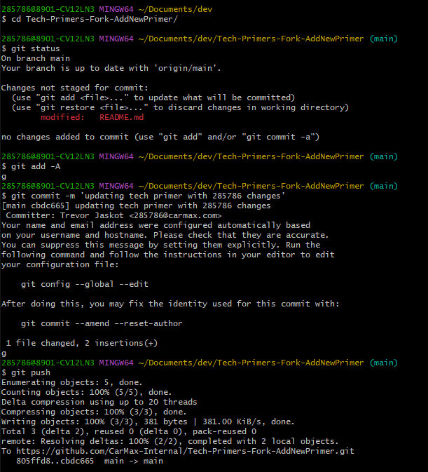

# Tech Primer Contribution Workflow

## Prerequisites
- Git CLI
- Terminal
- IDE (Integrated Development Environment)

## Assumptions
- How to use GitHub SaaS product

## Instructions

Search for and select the tech primer on which you want to contribute through Carmax-Internal Github Organization.

- 

Fork the repository.

- 

Add a new repository name with "-Fork-<reasoning>" for contribution using CamelCase syntax. For example,
this primer contribution was for forking a repository, so we added "-Fork-AddNewPrimer".

- 

After clicking Create Fork you will be brought to the overview page of new repository.

- 

You will then need to clone the forked repository locally to make necessary changes.

- 

Using terminal and Git cli clone fork locally.

- 

Make all the changes!!! :)

- 

Review changes by using git status, then add, commit, and push said changes to your branch in forked repo.

- 

Once you have pushed the changes, you'll be able to review these changes on Github UI.

- 

When you are ready, navigate to "Pull Requests" section and create "New Pull Request".

- 

Once you are on the "Comparing Changes" page, you will need to compare these changes across forks.

- 

Select the original base repository branch from which you originally forked, and select head repository
branch you wish to merge.

- 

Review if the changes are "Able to Merge" and the actual changes under files changed section at bottom of screen.
Then go ahead and "Create Pull Request".

- 

This will bring you to a confirmation screen where you need to select "Create pull request" button. This screen
offers you the option to create a draft Pull Request by selecting the dropdown on the button.

- 

Once you have the PR open, add Reviewers who will confirm your changes are valid, Assigness of the PR (usually 
this will be you as you are the one making changes and asking for PR contribution), add "enhancement" label.
Once all of that is finished, you have approvals from reviewers, then "Merge pull request" into original repo!

- 

From here you will be able to see your contributions in the original repo itself!

- 

Now only one more step remains: to delete forked repo now that changes have been contributed.

- 

Navigate to Settings section and scroll all the way down to "Danger Zone". Select "Delete this repository" button.

- 

This will bring a modal popup confirmation box. Select "I want to delete this repository".

- 

A manual confirmation section will open and you will have to type the full name of Org and forked repo to delete.
Once you have typed the name, the "Delete this repository" button will be enabled. Select it.

- 

Now you are finished!! Thank you so much for your contributions!! We look forward to your next go around :D

### Further Reading
- [Forking Git Repo](https://docs.github.com/en/get-started/quickstart/fork-a-repo)

### Points of Contact
- Author: CPE Engineering