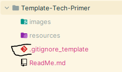
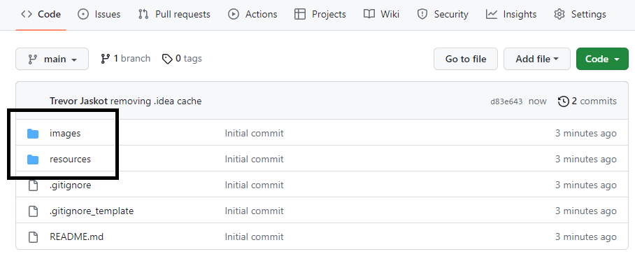

# Tech Primer Creation Workflow

## Prerequisites
- Git CLI
- Terminal
- IDE (Integrated Development Environment)

## Assumptions
- How to use GitHub SaaS product

## Instructions

Navigate go to Carmax Internal github repository.

- 

Create new repo with tech primer template.

- 

Enter both description and title.

Once created, you will then be brought to new repo overview

- 

After creating new repository click on setting icon next to the word "About" on overview
page and then **YOU MUST ADD THESE 4 MANDATORY TOPICS**:
- tech-primer
- tech-primers
- techprimer
- techprimers

- 
- 

No need for adding a .gitignore file, Tech Primer template comes with all carmax supplementals and locally generated
files and folders already written within file.
- If you want to replace current .gitignore file, rename .gitignore_template with .gitignore

- 

Here you will see two main folders. Both of which contain a .gitkeep file. This is for git itself
as they are currently blank folders and will not be pushed to the repo if a folder does not contain any
content: [How Git Keep Works](https://www.tutorialspoint.com/what-is-gitkeep).
One populated with content, you can either delete or leave the .gitkeep file. There is no
harm in leaving it once the folder is populated; but for cleanliness, you can remove once folder contains
resources.
- images
  - used for storing all images rendered in main ReadMe.md file
- resources
  - used for storing any additional resources a reader might need to have
for understanding or building tech primer product. This can be anything, such as
a word document User Guide, or an architecture diagram, or even a video supplementing
the instructions of a Tech Primer.

- 

The ReadMe.md file will be where all information regarding Tech Primer is placed.

Your current ReadMe.md template has examples on how to hyperlink and create bullet points.
As there are copious amount of Markdown resources, additional styling guide syntax can be found by searching online.

The current structure of this ReadMe.md file will need to be followed. Items which need updating
prior to publishing Tech Primer for CPE review:

Mandatory ->
- Title
- Prerequisites
- Assumptions
- Instructions
- Points of Contact

Optional ->
- Sub Instructions
- Sub Sub Instructions
- Further Reading & Reference Links

When finished, **create a new branch** under [Tech-Primers](https://github.com/CarMax-Internal/Tech-Primers),
add a text file under the folder "List of Tech Primers" with a link to newly created Tech Primer, 
commit it to a new branch, create a Pull Request to main
branch, and contact reviewers for approval! If there is questioning around this, open "Template Link File" under
"List of Tech Primers" folder and that will show you what to replace.

- 

- 

- 

Any remaining questions can be brought up with CPE team. We are glad to help towards bettering our 
relentless execution!

Happy coding!!!

### Points of Contact
- Author: CPE Engineering